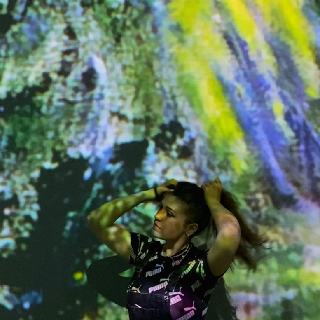

# First Impression

<!-- This is a comment, only visible to the author: Add a link to your presentation. -->
<!-- Presentations do not need to be a PDF, you may link elsewhere, such as Figma, YouTube, etc. -->
<!-- Consider adding navigation to each section (About, Featured Projects, Notes, etc.) -->

- [View Presentation](img/surname-draft-first-impression-2023.pdf) (PDF) <!-- Add helpful hint as to what kind of file or destination is here. -->
- [About](#about)
- [Featured Projects](#featured-projects)
- [Notes](#notes)

## A little bit about me

<!-- Consider including a headshot. We’re not designing, so keep the image width/height around 320px x 320px (square). Replace "surname" with your surname in the file name. -->

## Miroslava Jančárová
Hey, I'm Mimi, an animation student with a passion for pushing the boundaries of creativity. I find joy in experimenting with various art media, striving to bring imagination to life in every project I undertake.

## Featured Projects

This was my first 3D animation where the theme of the "Hidden World" became both inspiration and a challenge. Despite my aversion to insects and many nightmares about maggots during its creation, this project served as a transformative learning experience.

Crafted within three intense months, this short film reflects a leap in my animation skills. As I reflect on "Food Chain" months later, I now notice numerous mistakes. I see this as a positive sign – a reminder that growth comes from learning and acknowledging errors.

I have a passion for details, yet creating intricate 3D scenes is a bit of a gamble – there's always the exciting possibility of my laptop exploding during rendering. This experience has become a lesson in patience for me.

### Food Chain

<!-- Use a static poster image or animated GIF, but no video files. Again, keep the image width/height manageable, around 1280x x 720px (16:9 aspect ratio), or a max-width of 1280px. -->

- A short description about the project — *the what*.
- A short description about the significance of the project — *the whys*.
- A short description about the outcome of the project — *the result or takeaway*.

<!-- Use the same stucture above for the rest of your featured projects. -->

