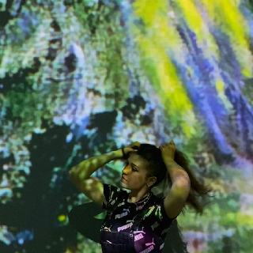
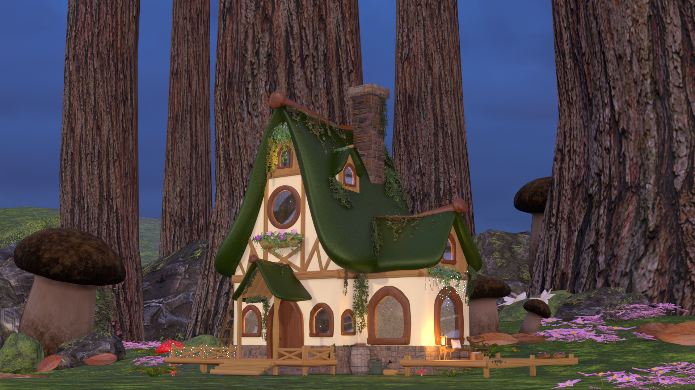
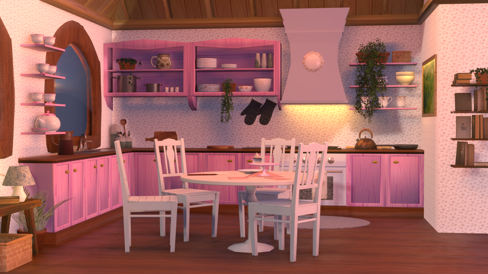
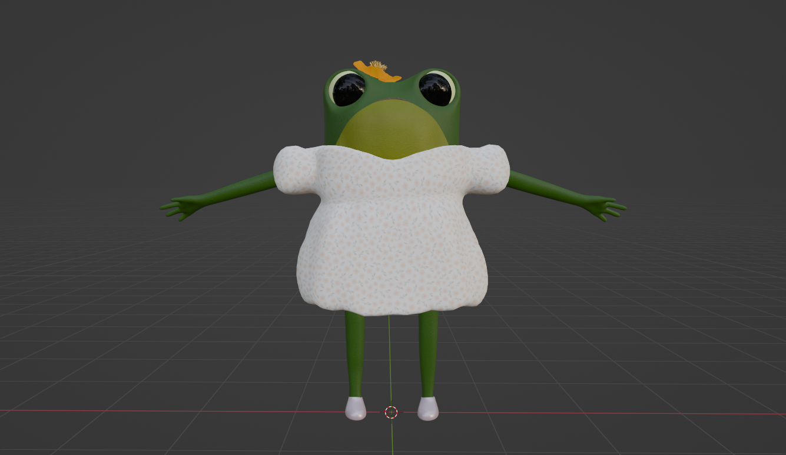
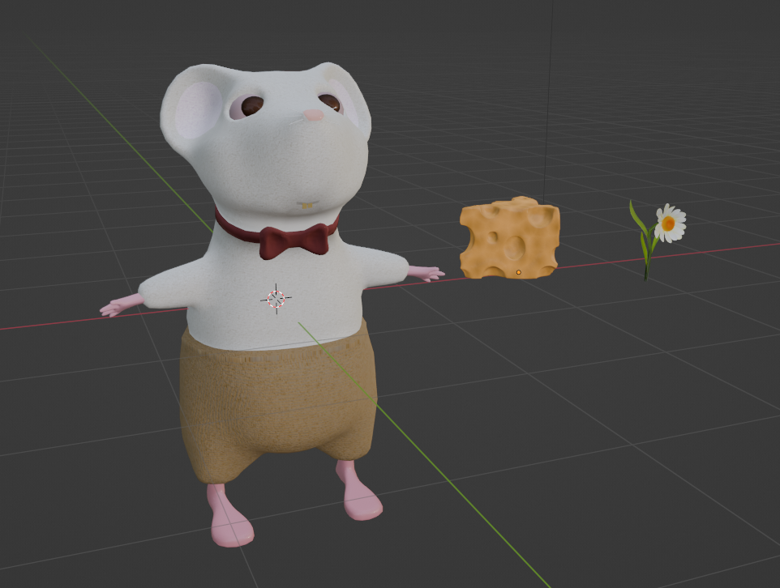

# First Impression

<!-- This is a comment, only visible to the author: Add a link to your presentation. -->
<!-- Presentations do not need to be a PDF, you may link elsewhere, such as Figma, YouTube, etc. -->
<!-- Consider adding navigation to each section (About, Featured Projects, Notes, etc.) -->

- [A little bit about me](#a-little-bit-about-me)
- [A Selection Of My Projects](#a-selection-of-my-projects)

## A little bit about me

<!-- Consider including a headshot. We’re not designing, so keep the image width/height around 320px x 320px (square). Replace "surname" with your surname in the file name. -->

## Miroslava Jančárová
Hey, I'm Mimi, an animation student with a passion for pushing the boundaries of creativity. I find joy in experimenting with various art media, striving to bring imagination to life in every project I undertake.

## A Selection Of My Projects

### Food Chain

<!-- Use a static poster image or animated GIF, but no video files. Again, keep the image width/height manageable, around 1280x x 720px (16:9 aspect ratio), or a max-width of 1280px. -->

This was my first 3D animation where the theme of the "Hidden World" became both inspiration and a challenge. Despite my aversion to insects and many nightmares about maggots during its creation, this project served as a transformative learning experience.

Crafted within three intense months, this short film reflects a leap in my animation skills. As I reflect on "Food Chain" months later, I now notice numerous mistakes. I see this as a positive sign – a reminder that growth comes from learning and acknowledging errors.

I have a passion for details, yet creating intricate 3D scenes is a bit of a gamble – there's always the exciting possibility of my laptop exploding during rendering. This experience has become a lesson in patience for me.

### Where there is Love there is Life

<!-- Use a static poster image or animated GIF, but no video files. Again, keep the image width/height manageable, around 1280x x 720px (16:9 aspect ratio), or a max-width of 1280px. -->

A short stop motion animation (claymation) about waiting for a loved one to finally come home.

I've always wanted to give stop-motion animation a shot, and diving into this project was both interesting and challenging. I quickly learned that precision and patience are key – move anything by a millimeter, and boom, the whole scene transforms. 

Although I initially thought of using this technique for my bachelor's film, the reality check hit hard – it's pretty time-consuming and complex. Still, I enjoy the hands-on aspect of crafting and molding my creations. I'm thinking about making a proper stop-motion film in the near future. So stay tuned!

### Fiona the Frog's Delightful Tea Party

<!-- Use a static poster image or animated GIF, but no video files. Again, keep the image width/height manageable, around 1280x x 720px (16:9 aspect ratio), or a max-width of 1280px. -->

(img/*.jpg/*.png/Fionas-kitchen.png)

A 3D animated adventure about Fiona the frog that I am currently working on. 

In her cozy cottage, Fiona is excitedly preparing a delightful tea party for her animal friends. Despite her efforts, Fiona becomes sad when her friends don't show up. Sadly, she starts putting away the dishes and cupcakes, thinking her party evening is ruined. 

All of a sudden she hears a knock on the door! It's Oliver the mouse, bearing cheese and Fiona's favourite flower as gifts. Fiona's frown turns upside down as she welcomes Oliver with a tight hug. Her home is soon filled with joy as they share memorable moments together. 

"Fiona the Frog's Delightful Tea Party" is a heartwarming tale of friendship and surprise, showing us that the best moments often come when we least expect them. This story for everyone, filled with warmth and joy, reminds us all that simple tea parties can turn into magical celebrations of friendship.

<!-- Use the same stucture above for the rest of your featured projects. -->

