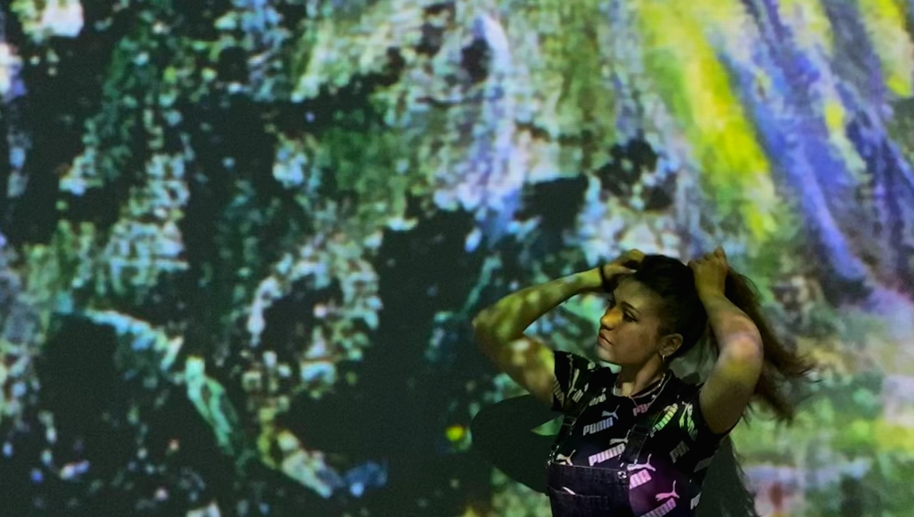
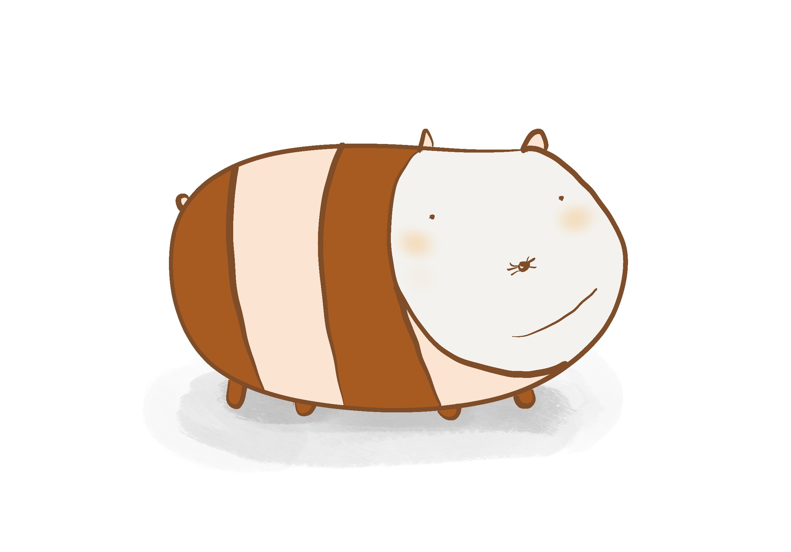

Hey, I'm Mimi, an animation student with a passion for pushing the boundaries of creativity. I find joy in experimenting with various art media, striving to bring imagination to life in every project I undertake.

Outside the realm of animation, you'll often find me in the kitchen, satisfying my love for baking (a delightful escape during moments of procrastination) or tending to my growing collection of house plants, or playing chess so I can finally beat my dad (or at least my baby brother).

I believe in cherishing every special occasion, and I love to bring people together by organizing memorable yet intimate parties. Whether it's a promotion or a random Tuesday, I find any excuse to celebrate and share joy with those around me.

I would love to illustrate a children's book and to open my own tattoo studio and a flower shop in one one day. My goal is to once retire on a warm remote island where I would let my creative genius loose and create anything and everything while enjoying the ocean breeze.

As I navigate my creative journey, I'm eager to contribute my unique perspective to the animation industry. Join me on this exciting adventure where creativity knows no bounds, and every project is a canvas for magic.

